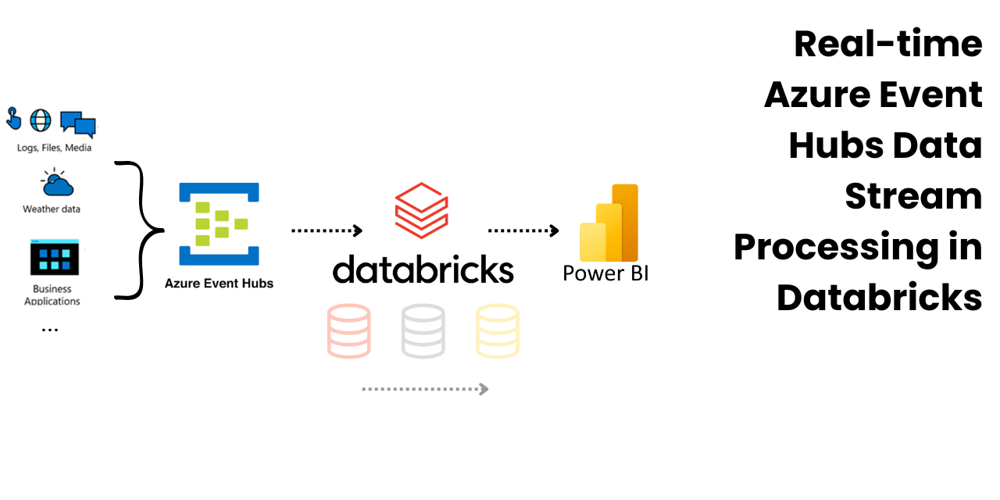

This project explores Azure EventHubs as a data source to be consumed within Databricks and a dashboard set up in PowerBI

### TL;DR
- Real-time event data stream from Azure Event Hubs (relevant in IoT, telemetry, logging etc.)
- Databricks stream processing in Medallion architecture
- Live dashboarding in Power BI connected to Databricks

# Azure Event Hubs

Azure Event Hubs is a fully managed, real-time data ingestion service that is simple, trusted, and scalable. It can stream millions of events per second from any source to build dynamic data pipelines and immediately respond to business challenges. Event Hubs can process and store events, data, or telemetry produced by distributed software and devices. It is ideal for applications such as logging, telemetry, fraud detection, and live dashboarding.

We use this service to simulate data events generation.

1. Event producers: Entities that generate and send data to event hubs. Examples include server applications, IoT devices etc.
2. Event hubs: This is where data events are sent. There are partitions to segment data to improve parallel processing
3. Consumer groups and event receivers: These allow different end clients to have different views/access of the data in the event hubs.

# Databricks

Databricks is built on top of the Data Lakehouse and acts as a unified data analytics platform to process multiple different kinds of data that appear in the lakehouse, which combines features of the data warehouse and the data lake. Combined with the Unity Catalog, the Databricks platform allows end-to-end governance and usage of multiple accounts on multiple forms of data, multiple functions including ML models etc. Data is typically stored in the Medallion format (bronze -> raw ingested data with some extra auditing fields, silver -> transformations and joins to represent rudimentary business logic and prepare it in structure for basic business intelligence, gold -> aggregates representing finer business intelligence).

# Setup

### Databricks

Already set up on Azure with Unity Catalog for earlier experiments (will be deleted after a few runs of this project)

### Azure Event Hubs

1. Go to Azure portal > Event Hubs > Create
2. Select an appropriate subscription
3. Select an appropriate resource group (I picked the one where I hosted the Databricks workspace)
4. Give the namespace a name
5. Choose a location (preferably one close to the Databricks resources)
6. Select the Basic (allowed 1 consumer group and stores data for 1 day) pricing tier (upgrade if you have the finance)
7. Select the minimum throughput uints (upgrade if you have the finance)
8. Review and create the namespace
9. Go to resource and create Event Hub
10. Give the event hub a name
11. Select an appropriate number of partitions (I selected 1 for the purposes of this project)
12. Select a clean up policy and retention time (Delete after 1 hour by default)
13. Review and create
14. Go to Settings > Shared access policies
15. Click Add
16. Give the policy a name and give it Listen access
17. Click Create

### Generating data events

1. Go into the event hub and then Data Explorer
2. Click Send events
3. Select Custom payload if you're sending custom event data (we are)
4. Select the JSON content type
5. Fill up the payload in JSON format ({ "key" : "value"})
6. Click send (repeat if required)

### Connecting Databricks to Azure Event Hubs

1. Create an all-purpose compute with the 12.2 LTS runtime and a decent node
2. Go to Libraries and click Install new
3. Select Maven as the library source and search for the azure-eventhubs-spark package (or enter this coordinate: "com.microsoft.azure:azure-eventhubs-spark_2.12:2.3.22")
4. Attach the compute to a notebook
5. For the Shared access policy created above, copy over the Primary connection string
6. Also copy over the event hub name
7. Create an eventHubs config by envrypting the connection and passing the event hub name
8. Read the data in spark.readStream.format("eventhubs").options(\*\*eventHubsConfig).load(); this only reads the events that appear after the stream is started and the data is read in an encoded format
